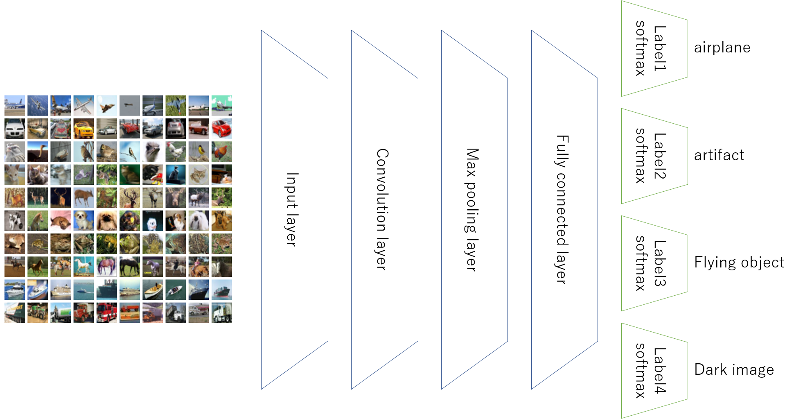

# KerasCNNwithMultiClass
Keras CNN for multiple kinds of classifiers

This notebook shows how to write convolutional neural network with multiple output layers, to predict multiple label on one image.
People recognize one image with multiple and different factors at same time; a cat is a cat, as well as a mammal, and animal. If the image is dark, it is recognized as a dark image with cat. An airplane is not only airplane, but also artifact and flying object.

## What is this?
I used Cifar10 image dataset to predict images into several categories, with adding my categories to the images.
- Label1: original category, with 10 labels
- Label2: new category, with 2 labels
- Label3: new category, with 4 labels
- Label4: new category, with 2 labels

Using convolutional neural network, written in Python and Keras, I made one neural network with one set of feature extraction layers, which are convolutional and pooling layers, and four classification layers, the softmax layer, by simply connnecting classifications to upper layers.

### Architecture

